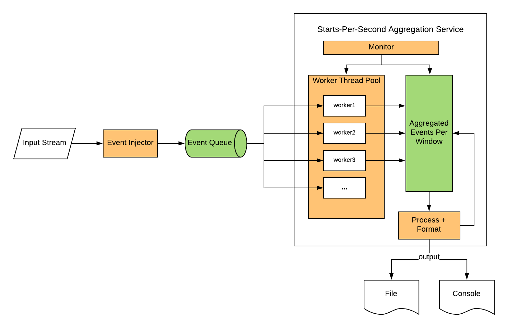

# Application to generate Stream Starts Per Second 

## Introduction
The goal of this application is to generate Stream Starts Per Second. This application processes JSON-formatted data from a specific HTTP stream, and aggregates on one second intervals. 

The following diagrams explains how this application works:

To elaborate:
1. The Event Injector captures JSON data from the input stream and forward the data to Event Queue.
1. The Event Queue is a `BlockingQueue` which caches raw JSON events. It supports event retrieval in a multi-threading flavor, and blocks retrieval request whenever queue is empty.
1. Starts-Per-Second Aggregation Service manages the data processing workflow, monitors and outputs the aggregated results. Starts-Per-Second Aggregation Service contains the following parts:

    1. Worker thread. It is the consumer of the Event Queue. Once a new event comes, it validates the data and increments the event freqency in the coresponding window.
    1. Worker thread pool. It manages a pool of worker threads. The number of workers can be easily adjusted for scalability.
    1. Aggregated event cache. It is a `ConcurrentMap` that groups valid events into windows by device, title, country, and records. It is consistently updated by worker threads in the corresponding window.
    1. Monitor. It periotically checks and logs status of Aggregated event cache and worker thread pool.

1. Aggregated SPS metrics can be outputted as console log and/or a local file in JSON format. 

## Environment requirements

* Java 8 or above
* mvn

## How to run

* First, build the project and generate executable jar by executing:

  `mvm package`

* Then:

  `java -jar target/project-sps-1.0-SNAPSHOT.jar`

* To terminate the application, simply enter `Ctrl + C`.

By default, the application captures streaming data from https://tweet-service.herokuapp.com/sps and outputs the aggregated Starts-Per-Second metrics to `target/output.txt`. For customized configuration, please refer to the next section. 

## Configuration

Configuration is specified in `src/main/resources/config.properties`.

* To specify input stream URL: `source_url`
* To specify output file path: `output_file_path`
* To specify aggregation window size in millis: `window_size_millis`
* To output sps metrics to console output:  `enable_console_output=true`; else set to false.
* To output sps metrics to a specific file: `enable_file_output=true`; else set to false. 

Additional parameters for fine-tuning :

* To specify the event queue size:  `event_queue_size`
* To specify the number of worker threads that process the data concurrently: `worker_thread_pool_size`

## Further Thoughts

### How to scale out the design
* To gain more processing power from multiple processors, we can deploy the workflow to each processor and distribute the input data to each of them
* Use Kafka + Flink instead when data size grows larger

### How to handle variations in data volume
* Make Event Queue size dynamically adjusted
* Make worker thread pool size dynamically adjusted
* If service deployed to a cluster, could dynamically adjust the cluster size
* All the above adjustment should be based on precise monitoring

### How to productize 
* Add javadoc of classes and major functions
* Apply automated and continous build and deployment process 
* Apply automated releasing process with version control
* Monitor system health
* Load test the system

### How to verify
* Create a comprehensive list of test cases, to reach 100% unit test coverage
* Compare results between single-thread version and multi-threads version
* Compare throughput of input and output
